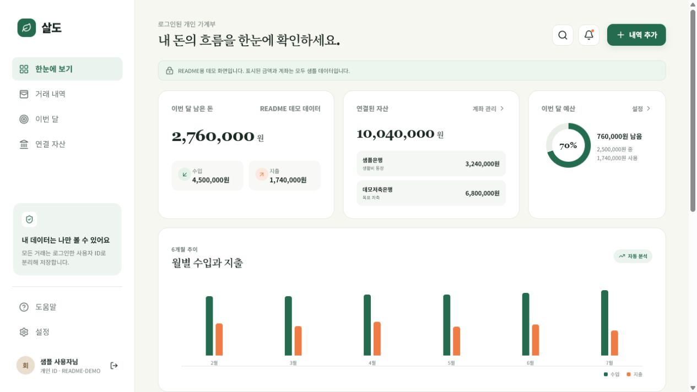
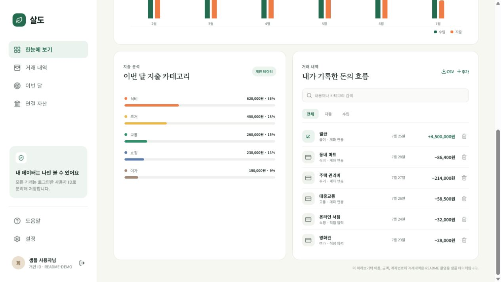
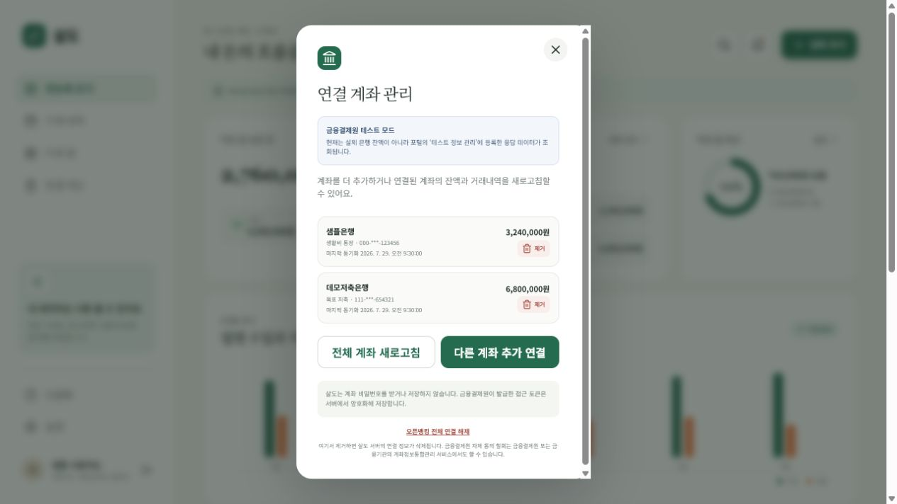

# 살도 (Saldobook)

Google·카카오 로그인과 금융결제원 오픈뱅킹 연동을 지원하는 사용자별 가계부입니다.

- 운영 URL: [https://saldobook.coders.kr](https://saldobook.coders.kr)
- 현재 금융 연동 상태: 금융결제원 **테스트베드**
- 백엔드: Java 21, Spring Boot 3.4, Spring Data JPA, Flyway
- 프런트엔드: TypeScript, Next.js 16, React 19
- 데이터베이스: PostgreSQL 16

> 현재 배포본은 실제 은행 운영망이 아닙니다. 실제 계좌 잔액과 거래내역을 제공하려면 금융결제원의 이용기관 운영 승인, 계약, 보안 점검 및 운영 키 발급이 필요합니다.

## 서비스 화면

아래 이미지는 제품 흐름을 설명하기 위한 샘플 화면입니다. 이름, 금액, 계좌와 거래내역은 모두 가상 데이터이며 실행 중인 서비스에는 데모 데이터 모드가 없습니다.

### 한눈에 보는 개인 대시보드

[](https://saldobook.coders.kr)

- 이번 달 수입·지출·남은 돈과 연결 자산 합계를 한 화면에서 확인합니다.
- 월 예산의 사용률과 남은 금액을 자동 계산합니다.
- 최근 6개월 수입과 지출 추이를 비교합니다.

### 거래내역과 소비 분석



- 계좌에서 불러온 거래와 사용자가 직접 입력한 거래를 구분합니다.
- 내용·카테고리 검색, 수입·지출 필터와 CSV 내보내기를 지원합니다.
- 카테고리별 지출 금액과 비중을 자동으로 계산합니다.

### 여러 계좌 연결과 관리



- 연결된 여러 계좌의 마스킹 번호, 잔액과 마지막 동기화 시간을 확인합니다.
- 전체 계좌를 한 번에 새로고침하거나 다른 계좌를 추가로 연결할 수 있습니다.
- 계좌를 개별 제거하거나 오픈뱅킹 연결 전체를 해제할 수 있습니다.
- 계좌 비밀번호는 수집하지 않으며 금융결제원 접근 토큰은 서버에서 암호화합니다.

> 화면의 샘플은행, 데모저축은행, 금액, 계좌번호와 거래내역은 실제 금융정보가 아닙니다. 실제 로그인 화면을 새로 촬영할 때는 사용자 이름, 개인 ID, 계좌번호, 잔액과 거래내역을 반드시 마스킹해야 합니다.

## 사용자가 이용하는 흐름

| 단계 | 화면/기능 | 사용자 경험 |
|---:|---|---|
| 1 | 소셜 로그인 | Google 또는 카카오 계정으로 본인 가계부에 로그인합니다. |
| 2 | 한눈에 보기 | 이번 달 수입·지출·남은 금액, 예산 사용률과 연결 자산 합계를 확인합니다. |
| 3 | 거래 기록 | 수입·지출을 직접 등록하고 검색, 유형 필터, 삭제 및 CSV 내보내기를 사용합니다. |
| 4 | 소비 분석 | 카테고리별 지출 비중과 최근 6개월 수입·지출 흐름을 확인합니다. |
| 5 | 계좌 연결 | 금융결제원 인증 화면에서 본인이 동의한 여러 계좌를 연결합니다. |
| 6 | 계좌 동기화 | 계좌별 잔액과 거래내역을 가져오며, 일부 계좌가 실패해도 나머지는 계속 처리합니다. |
| 7 | 연결 관리 | 계좌를 추가하거나 개별 제거하고, 필요하면 오픈뱅킹 연결 전체를 해제합니다. |

### 개인 대시보드

- 모든 금액과 거래는 로그인한 사용자 ID를 기준으로 분리됩니다.
- 이번 달 수입, 지출, 남은 돈과 연결된 계좌 잔액을 한 화면에서 확인합니다.
- 예산을 설정하면 현재 지출 대비 사용률과 남은 예산을 계산합니다.
- 실제 저장 데이터가 없으면 가상 거래를 대신 보여주지 않고 빈 상태로 안내합니다.

### 거래와 분석

- 직접 입력한 거래와 오픈뱅킹에서 가져온 거래를 구분합니다.
- 동일한 외부 거래가 다시 조회돼도 중복 저장하지 않습니다.
- 내용이나 카테고리로 검색하고 수입·지출 유형을 필터링할 수 있습니다.
- 현재 목록을 UTF-8 CSV로 내려받을 수 있습니다.
- 카테고리별 소비 비중과 월별 추이를 자동 계산합니다.

### 다계좌 오픈뱅킹

- 금융결제원에서 발급한 핀테크 이용번호를 사용하며 실계좌번호를 직접 수집하지 않습니다.
- 연결된 모든 계좌를 관리 화면에 표시합니다.
- 계좌별 잔액 조회와 거래내역 조회 결과를 독립적으로 처리합니다.
- 금융결제원 오류가 발생하면 실패 단계, 응답 코드와 안전하게 정리한 메시지를 사용자에게 표시합니다.
- 사용자가 제거한 계좌는 일반 새로고침으로 다시 활성화되지 않으며, OAuth 연결을 다시 완료한 경우에만 복원됩니다.

## 주요 기능

- Google·카카오 OAuth 2.0 로그인
- JDBC 기반 서버 세션과 사용자별 데이터 격리
- 수입·지출 등록, 삭제, 검색 및 필터
- 월 예산과 사용률
- 카테고리 분석과 최근 6개월 추이
- CSV 내보내기
- 금융결제원 오픈뱅킹 OAuth 계좌 연결
- 여러 계좌 등록과 계좌별 잔액·거래 동기화
- 테스트베드/운영망 상태와 실계좌 데이터 가능 여부 표시
- 계좌별 부분 실패 처리 및 금융결제원 응답 코드 표시
- 금융결제원 `A0308` 기관 설정 오류의 해결 방법 안내
- 개별 계좌 제거와 전체 연결 해제
- AES-256-GCM 토큰 암호화
- 외부 거래 지문을 이용한 중복 저장 방지

## 아키텍처

```text
Browser
  └─ HTTPS
      └─ nginx / Next.js static frontend
          ├─ /                 정적 SPA
          └─ /api/*            Spring Boot로 프록시
                                ├─ PostgreSQL / Flyway
                                ├─ Google OAuth
                                ├─ Kakao OAuth
                                └─ 금융결제원 Open Banking API
```

프런트엔드는 빌드 시 정적 파일로 내보내 nginx가 제공합니다. 인증, 데이터 소유권 확인, OAuth 콜백, 금융 API 호출은 모두 Spring Boot에서 처리합니다.

## 디렉터리

```text
backend/
  pom.xml
  src/main/java/kr/saldo/
  src/main/resources/
    application.yml
    db/migration/
frontend/
  app/
  components/
  Dockerfile
coders.yaml
compose.yaml
```

## 로컬 실행

### 1. 환경 변수 준비

```powershell
Copy-Item .env.example .env
```

`.env`에 본인이 발급받은 개발용 값을 입력합니다. `.env`는 Git에서 제외됩니다.

### 2. OAuth Redirect URI 등록

로컬 HTTPS 프록시를 사용하지 않는 경우 OAuth 제공자가 HTTP localhost 콜백을 허용하는지 확인해야 합니다.

```text
Google: {PUBLIC_URL}/api/auth/google/callback
Kakao:  {PUBLIC_URL}/api/auth/kakao/callback
KFTC:   {PUBLIC_URL}/api/openbanking/callback
```

### 3. Docker Compose 실행

```powershell
docker compose up --build
```

- 웹: `http://localhost:3000`
- API 상태: `http://localhost:8000/actuator/health`
- PostgreSQL: `localhost:5432`

## 환경 변수

| 변수 | 필수 | 설명 |
|---|---:|---|
| `PUBLIC_URL` | Y | 외부에서 접근하는 서비스 원본 URL |
| `GOOGLE_CLIENT_ID` | Y | Google OAuth 웹 클라이언트 ID |
| `GOOGLE_CLIENT_SECRET` | Y | Google OAuth Client Secret |
| `KAKAO_REST_API_KEY` | Y | 카카오 REST API 키 |
| `KAKAO_CLIENT_SECRET` | Y | 카카오 로그인 Client Secret |
| `OPEN_BANKING_CLIENT_ID` | Y | 금융결제원 Client ID |
| `OPEN_BANKING_CLIENT_SECRET` | Y | 금융결제원 Client Secret |
| `OPEN_BANKING_REDIRECT_URI` | Y | 금융결제원 OAuth Callback URL |
| `OPEN_BANKING_USE_ORG_CODE` | Y | 금융결제원 이용기관코드 10자리 |
| `TOKEN_ENCRYPTION_KEY` | Y | Base64 인코딩된 무작위 32바이트 키 |
| `OPEN_BANKING_AUTHORIZE_URL` | N | 기본값은 금융결제원 테스트 인가 URL |
| `OPEN_BANKING_TOKEN_URL` | N | 기본값은 금융결제원 테스트 토큰 URL |
| `OPEN_BANKING_API_BASE_URL` | N | 기본값은 금융결제원 테스트 API v2.0 |
| `DATABASE_URL` | Y | PostgreSQL JDBC URL |
| `DATABASE_USERNAME` | Y | DB 사용자 |
| `DATABASE_PASSWORD` | Y | DB 비밀번호 |

암호화 키 예시 생성:

```powershell
$bytes = New-Object byte[] 32
[Security.Cryptography.RandomNumberGenerator]::Fill($bytes)
[Convert]::ToBase64String($bytes)
```

생성 결과는 비밀 저장소에만 보관하고 GitHub, 문서, 메신저에 올리지 않습니다.

## 금융결제원 테스트베드

테스트베드에서는 실제 은행 잔액이 아니라 금융결제원 포털에 등록한 테스트 응답 데이터가 반환됩니다.

발급 화면, 등록할 URL과 운영 전환 조건은 [금융 연동 설정 가이드](docs/FINANCIAL_INTEGRATION.md)에 정리했습니다.

1. 오픈뱅킹 서비스 신청 및 `이용 중` 확인
2. API Key 생성
3. 오픈뱅킹 서비스에 API Key 등록
4. Callback URL 등록
5. 테스트 정보 관리 권한 활성화
6. 사용자정보·잔액·거래내역 테스트 응답 등록
7. 살도에서 계좌 연결 후 전체 계좌 새로고침

운영 전환 시 테스트 URL 세 개를 금융결제원이 안내한 운영 URL로 교체하고 운영 Client ID/Secret을 별도 비밀값으로 등록해야 합니다.

현재 계좌 기능은 조회 전용이며 입금·출금이체(결제)는 구현되어 있지 않습니다. 실제 잔액과 거래내역은 금융결제원의 운영 이용기관 승인 및 조회 API 권한이 있어야 사용할 수 있습니다.

## 데이터 보호

- 모든 가계부 조회와 변경은 로그인된 사용자 ID로 제한합니다.
- 세션 쿠키는 `HttpOnly`, `Secure`, `SameSite=Lax`로 설정합니다.
- 금융 액세스 토큰과 리프레시 토큰은 AES-256-GCM으로 암호화해 저장합니다.
- 계좌 비밀번호, 실계좌번호, 소셜 로그인 비밀번호는 수집하지 않습니다.
- 계좌번호는 금융결제원이 제공한 마스킹 값만 화면에 노출합니다.
- Secret은 코드나 Git 이력에 저장하지 않습니다.
- POST·PUT·PATCH·DELETE 요청은 애플리케이션 전용 헤더를 검증해 교차 사이트 요청 위조를 차단합니다.

## 배포

`coders.yaml`은 coders.kr 멀티 서비스 배포 구성을 정의합니다.

- `web`: 정적 Next.js 산출물을 제공하는 nginx
- `api`: Spring Boot 애플리케이션
- `db`: 관리형 PostgreSQL
- 실행 모드: 자체 OAuth를 사용하는 `standalone`

배포 환경에는 위 환경 변수를 플랫폼의 Secret/환경 변수 관리 기능으로 등록해야 합니다. 배포 후 다음을 점검합니다.

```text
GET /actuator/health
GET /api/auth/me
Google 로그인 및 로그아웃
카카오 로그인 및 로그아웃
오픈뱅킹 OAuth state 검증
계좌 목록·잔액·거래내역 부분 실패
사용자 A/B 데이터 격리
세션 만료 및 재로그인
개별/전체 연결 해제
DB 백업과 복원
```

## 운영 전 체크리스트

- [ ] 개인정보처리방침과 이용약관 게시
- [ ] 금융결제원 이용기관 운영 승인 및 계약
- [ ] 운영 OAuth 앱 검수와 Redirect URI 고정
- [ ] Secret 회전 절차와 접근 통제
- [ ] PostgreSQL 자동 백업 및 복구 훈련
- [ ] 오류·감사 로그의 개인정보 마스킹
- [ ] 장애 알림, 지표, 상태 페이지
- [ ] 사용자 탈퇴 시 데이터·토큰 파기
- [ ] 동의 철회와 금융결제원 해지 절차
- [ ] 취약점 점검과 의존성 업데이트 정책

## 검증

프런트엔드:

```powershell
cd frontend
pnpm install --frozen-lockfile
pnpm build
```

백엔드:

```powershell
cd backend
mvn test
mvn package
```

전체 컨테이너:

```powershell
docker compose build
docker compose up
```

## 라이선스

소스는 공개되어 있지만 별도 오픈소스 라이선스는 부여하지 않았습니다. 재사용과 배포에는 저작권자의 별도 허가가 필요합니다.
